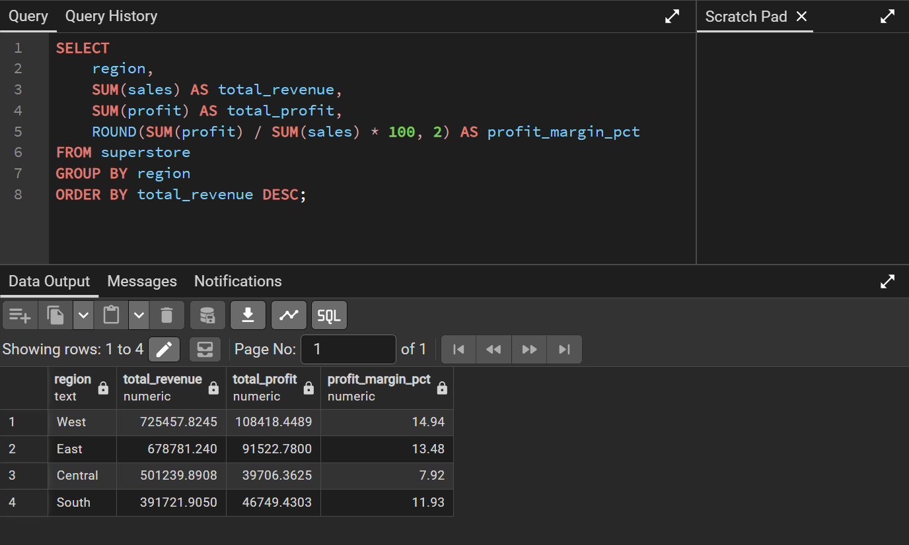
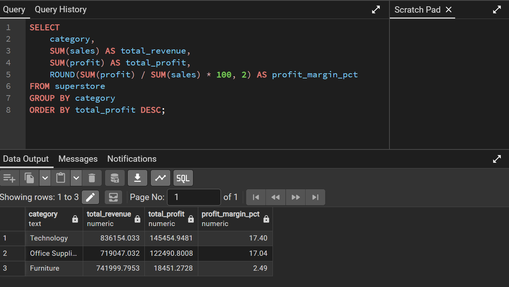
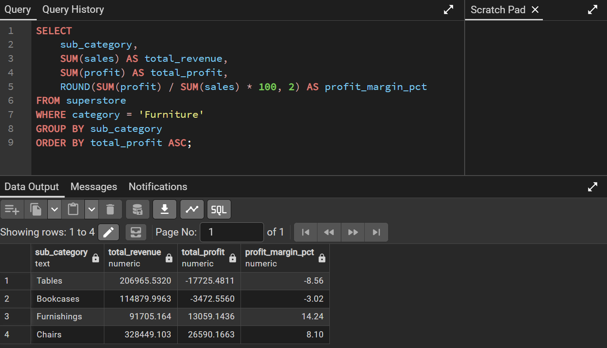
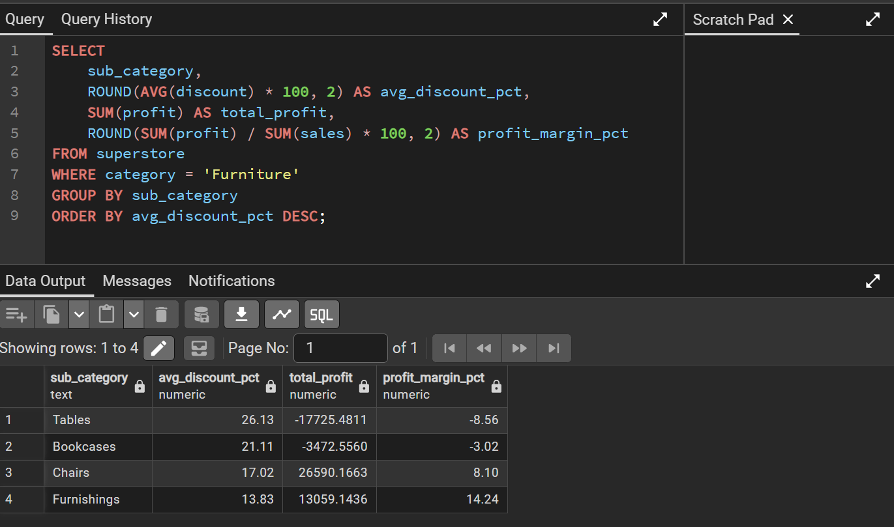
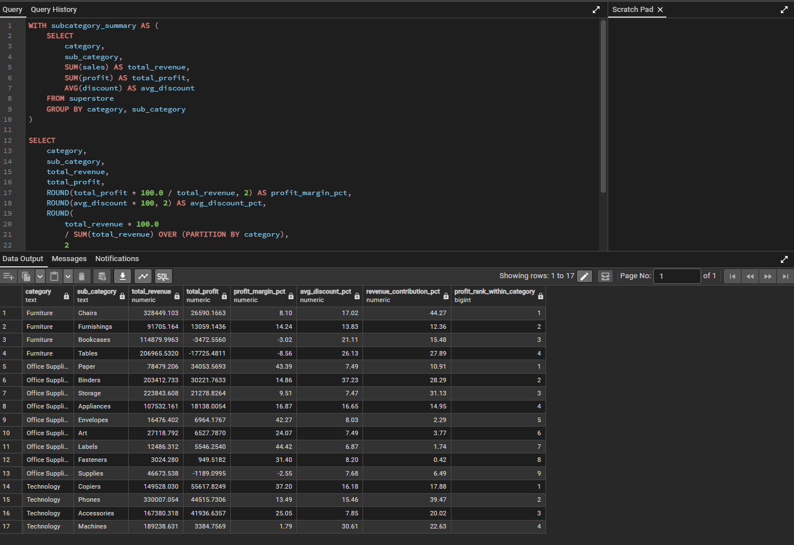
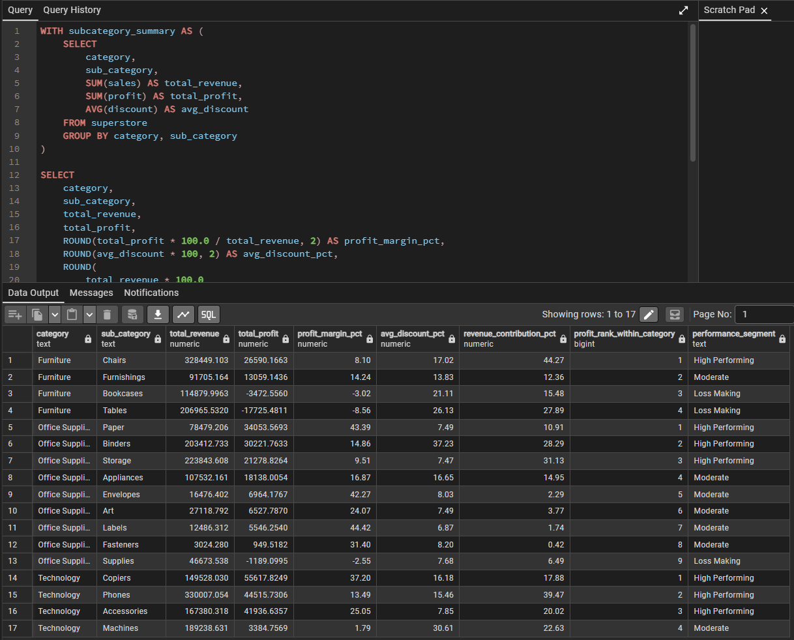
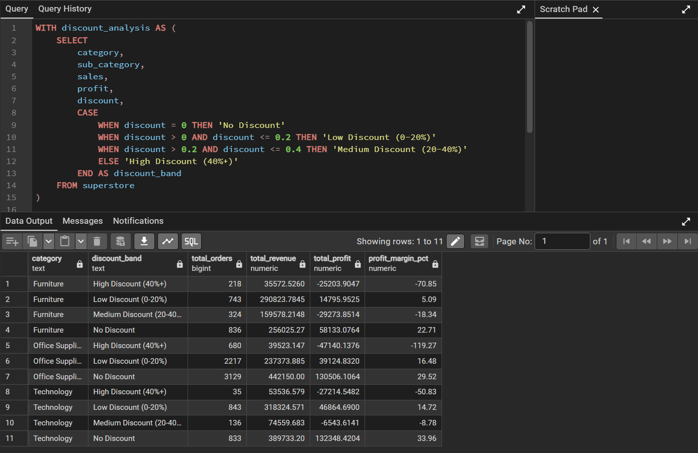

# 📊 Superstore Sales & Profitability Analysis

## 🔗 Quick Navigation

[Project Overview](#project-overview) • 
[Business Problem](#business-problem) • 
[Project Objectives](#project-objectives) • 
[Technical Skills](#technical-skills-demonstrated) • 
[Key Insights](#key-insights) • 
[Analytical Highlights](#analytical-highlights) • 
[Business Recommendations](#business-recommendations)

## 📊 Project Snapshot

**Goal:** Analyze retail sales data to identify profitability drivers and margin erosion.

**Tools Used:** PostgreSQL, Advanced SQL (CTEs, Window Functions)

**Dataset:** Superstore retail dataset

**Key Outcome:** Identified loss-making furniture subcategories and showed how high discount levels directly reduce profit margins.


## 📌 Project Overview

An end-to-end SQL analytics project that investigates revenue distribution, profitability drivers, and discount impact across a retail superstore dataset using PostgreSQL.

---

## 🔎 Business Problem

Retail businesses often generate strong sales revenue but struggle to maintain healthy profit margins due to aggressive discounting strategies and inefficient pricing structures.

This project analyzes sales and profitability performance across regions, categories, and sub-categories using structured SQL techniques. The objective is to identify margin erosion drivers, evaluate the impact of discounting, and uncover loss-making segments to support data-driven pricing decisions.

---

## 🎯 Project Objectives

- Analyze total revenue and profit distribution by region  
- Calculate profit margin percentages  
- Evaluate the impact of discounts on profitability  
- Identify loss-making categories and sub-categories  
- Rank top-performing categories within each region  
- Generate strategic business recommendations  

---

## 🛠 Technical Skills Demonstrated

- SQL Aggregations (SUM, GROUP BY)
- Profit Margin Calculations
- CTE (Common Table Expressions)
- Window Functions (RANK, PARTITION BY)
- Revenue Contribution Analysis
- Discount Sensitivity Modeling
- CASE-based Segmentation Logic
- Business Insight Communication

---

## 🗂️ Project Architecture

1. Database Creation & Table Design  
2. Structured CSV Data Import using COPY  
3. Revenue & Profit KPI Analysis  
4. Margin & Discount Impact Evaluation  
5. Category & Regional Deep-Dive Analysis  
6. Strategic Recommendation Framework  

---
## 📁 Project Structure

/sql  
   `01_database_setup.sql`  
   `02_data_import.sql`  
   `03_regional_analysis.sql`  
   `04_profitability_deep_dive.sql`

README.md
---

## ⚙️ How to Run This Project

1. Clone the repository

```bash
git clone https://github.com/komalkashyap2328-design/superstore-sales-profitability-analysis.git
```

2. Create the database in PostgreSQL

Run the script:

01_database_setup.sql

3. Import the dataset

Run:

02_data_import.sql

4. Execute analytical queries

Run the analysis scripts:

03_regional_analysis.sql  
04_profitability_deep_dive.sql

5. Review results and insights from query outputs and screenshots.

## 📌 Key Insights

- Furniture category showed margin instability despite strong revenue contribution.
- Tables and Bookcases operate at negative profit margins.
- High discount levels directly correlate with margin erosion.
- Sub-categories contributing high revenue do not necessarily rank highest in profitability.
- High-discount (40%+) transactions consistently generate severe negative margins across all categories.

---

## 📊 Analytical Highlights

The following queries demonstrate how SQL was used to uncover key profitability drivers across regions, categories, and discount levels.

### Regional Revenue & Profit Analysis



### Category-Level Profitability



### Furniture Subcategory Profitability



### Discount Impact on Furniture Profitability



### Advanced Subcategory Performance Model



### Subcategory Segmentation Logic



### Discount Band Profitability Analysis



---

## 💡 Business Recommendations

- Implement a balanced discount strategy in the Central region to improve margin retention.
- Re-evaluate pricing models for loss-making furniture sub-categories.
- Optimize promotional campaigns to protect profit while sustaining revenue growth.
- Monitor regional performance using contribution-based profitability analysis.

---

## 🚀 Project Outcome

This project simulates a real-world retail analytics scenario by building an end-to-end analytical workflow using enterprise-level SQL practices.

It demonstrates:

- Structured database implementation
- Clean data ingestion process
- KPI-driven analytical thinking
- Strategic insight extraction
- Business-oriented recommendation development

This framework can be extended into dashboard reporting, automation pipelines, or predictive modeling for advanced retail performance analysis.

## 📊 Future Improvements

- Power BI Interactive Dashboard
- Excel Analytical Model
- Automated KPI Reporting
